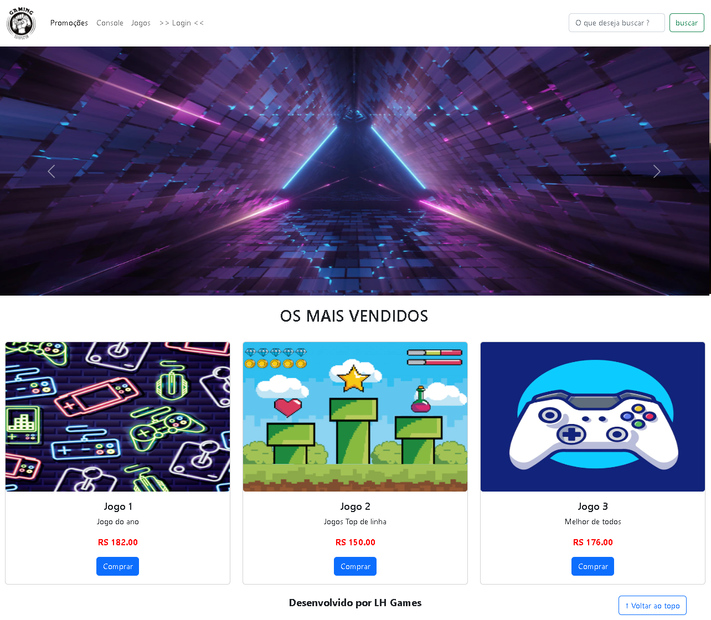
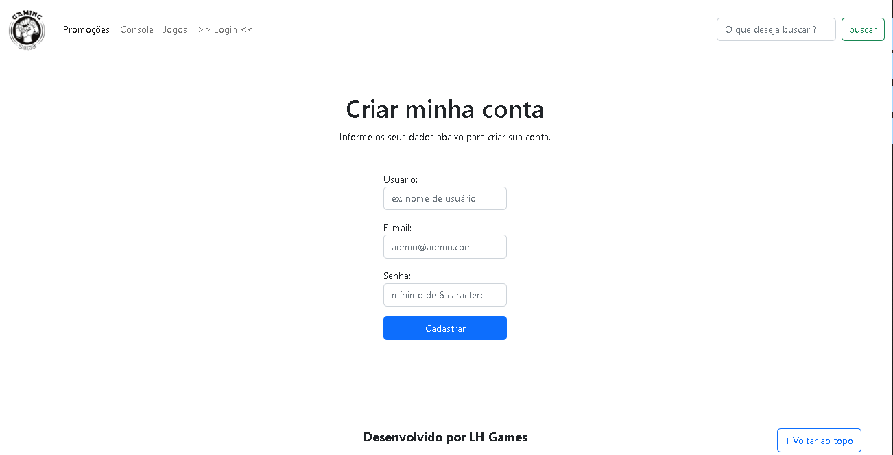

# Curso de Frontend EaD SENAI-SP

## Modulo: Codificação Frontend

### 07b - SP2 - Atividade 2: Desenvolvimento da página index / login-cadastro do site

##Telas :

  

  <h4>index </h4>
  
  <h4>Login </h4>

  
    
 <li>para fazer login digite  nome: admin --- senha: 123456    

  <h4>Cadastro </h4>
  
   
 <li>para testar o cadastro digite  nome: admin --- email: admin@admin.com --- senha: 123456    

  

